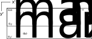
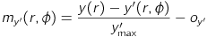

# JFXRadialEffect
## Non-affine transformation effects in JavaFX: Radial transformation as an example

Using the JavaFX-effect javafx.scene.effect.DisplacementMap we want arbitrary
Node-objects to appear curved.
This is illustrated in the sketch below:

We start out with a Node which occupies a rectangular area (a).
After the effect has been applied, we want an output that looks similar to (b):
we construct a Node which is slightly larger than the old node to accommodate
the original Node when it is curved.

### Parameterization

We know the bounds of the original Node as well as the radius we want
to use: .
We require the middle-width to stay the same

,

which leads to constraints on the angles

,

.

For the radius we require

,

which leads to

.

We are now in the position to derive the bounds of our final Node.
For this, we recall the coordinate transformation for polar
coordinates

,

to find

,

.

Using these values, we can now parameterize the original and target Node in
-space:

,

,

,

,

which we will use to construct a displacement map.

### Displacement map

The DisplacementMap uses a FloatMap to map a pixel in the target Node
(transformed Node) to a pixel in the original node (untransformed Node) whose
color the target image will use at the given position

,

where c' is the color of the (x',y')-pixel in the target Node, c is the color
of a pixel in the original Node,  is
an offset and  is the
actual displacement map.
We have seen that the target node is larger than the original node while the
displacement map can not leave the bounds of the original node.
This is why we use the geometry in the sketch below:

We construct a new node which includes the original node plus spacing to fit
the transformed geometry.
We call the area bounded by 
the sample and the area bounded by 
the target.
For our problem we get the map

,

.

We now loop over , where 
and  and fill the map.

Care needs to be taken in terms of discretization.
We want at least one entry in our map for each pixel which means we need to
require , which leads to

,

for the angular part.
